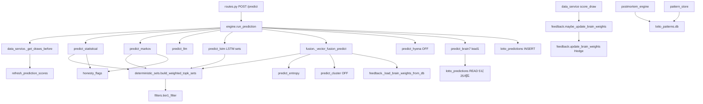

# 1군(MONEY lol) 벤치·이식 인벤토리 — READ-ONLY

📅 2026-07-29 · **코드/DB 수정 없음** · 커밋 없음  
📌 1군 SSOT: `D:\MONEY lol\My_Library\app\lotto\` · ROK21: `D:\ROK21\app\testlotto\`  
📌 근거: 코드 실측 · `20260729_MONEY1GUN_TIER_DEEP.md` · `20260729_MONEY1GUN_VS_ROK21.md` · `BENCH_PROTOCOL.md`

---

## Executive summary

| 축 | 1군 | ROK21 gap | 권장 |
|----|-----|-----------|------|
| 세트 조립 | `deterministic_sets` top-k (결정론) | `random.choices` 동결 · `set_diversity` 후처리 | **P0 lab copy** (predict 동결 경로 밖) |
| 벤치 속도 | full 1182만 (survey 공통) | 동일 · `_k_posthoc`만 n=50 샘플 | **P0 QUICK_GATE** 프로토콜 추가 |
| fusion | **활성** · DB Hedge 가중 | **미배선** (K-D) | **P1 survey-only** (wire=형 GO) |
| lead1 F1_V2_STRICT | 5뇌→wheel 5세트 | 파일 존재 · WIRE-V2 미사용 | **P1 READ-ONLY 비교** |
| honesty_flags | 10개 중앙 스위치 | 모듈 없음 | **P0 패턴 이식** (플래그만) |
| tier1_filter | 동일 규칙 | **이미 동일** | 유지 |
| postmortem | `lotto_patterns.db` 131k+ | 동계열 · hook OFF | **P1 signal survey** (K-BENCH-01 연계) |

---

## A) 1군 complete inventory

### A.1 파일 트리 (28 files · `app/lotto/`)

```
D:\MONEY lol\My_Library\app\lotto\
├── __init__.py
├── engine.py              ★ 오케스트레이터 · run_prediction · run_backtest
├── routes.py              ★ FastAPI /api/lotto/*
├── data_service.py        ★ draws fetch · _get_draws_before · army1 auto N+1
├── models.py              ★ lotto.db 스키마 · lotto_brain_weights 시드
├── filters.py             tier1_filter (합계·홀짝·구간·연속)
├── deterministic_sets.py  ★ build_weighted_topk_sets (결정론 top-k)
├── honesty_flags.py       ★ 10개 정직 스위치
├── fusion.py              ★ _vector_fusion_predict (4뇌 벡터 앙상블)
├── feedback.py            ★ analyze · Hedge update_brain_weights · ranking
├── predict_statistical.py stat 벡터·세트 (deterministic 경로)
├── predict_markov.py      markov 전이·결정론 visit
├── predict_llm.py         LLM 세트 (+ statistical fallback)
├── predict_llm_client.py  LLM API 클라이언트
├── predict_lstm.py        LSTM prob vector · GPU 학습
├── predict_hyena.py       메타합의 (stat~fusion 25세트 → 5세트)
├── predict_brain7.py      ★ lead1 · F1_V2_STRICT wheel
├── predict_entropy.py     Shannon 엔트로피 벡터 보정
├── predict_cluster.py     K-Means 클러스터 보정 (sklearn)
├── predict_missanalysis.py  2군 미당첨분석 (1군 폴더에 존재·별도 군)
├── predict_snake.py       2군 뱀 AI (hyena식 miss 메타)
├── postmortem_engine.py   ★ 회차별 pool/lead1 커버리지·갭
├── postmortem_position.py position 분석
├── postmortem_structure.py lead1 vs 당첨 구조 대조
├── pattern_store.py       ★ lotto_patterns.db READ-ONLY API
├── *.before_* / routes.before_*  (백업·레거시, 운영 제외)
```

**관련 외부 (같은 My_Library):**
- DB: `D:\MONEY lol\My_Library\data\lotto.db` · `lotto_patterns.db`
- 앱 루트: `app/config.py` (DATA_DIR)

### A.2 핵심 상수·레지스트리

| 상수 | 값 | 위치 |
|------|-----|------|
| `SETS_PER_BRAIN` | **5** | `engine.py:37` |
| `BRAIN_REGISTRY` | stat, markov, llm, lstm, fusion, hyena (6) | `engine.py:27-34` |
| `METHOD_TO_BRAIN_TAG` | 한글 method → brain_tag | `engine.py:36` |
| lead1 tag | `lead1` · `BRAIN7_TAG` | `predict_brain7.py:32` |
| POOL_BRAINS (lead1 입력) | stat, markov, llm, lstm, fusion (5) | `predict_brain7.py:25` |
| MIN_POOL_SETS | 25 (5뇌×5) | `predict_brain7.py:26` |
| F1_FORMULA | **F1_V2_STRICT** | `predict_brain7.py:40` |
| SEED_WEIGHTS (Hedge) | stat=1.5, markov=1.0, llm=2.5, lstm=2.0, hyena=1.0 | `feedback.py:18-24` |
| fusion VECTOR (4뇌) | DB `lotto_brain_weights` stat/markov/llm/lstm | `fusion.py:77` · `_FUSION_DB_BRAIN_TAGS` |
| hyena FALLBACK | stat=1, markov=1, llm=1.5, lstm=2.5, fusion=2.0 | `predict_hyena.py:16-22` |
| Hedge eta | **1.5** | `engine.py:590` · `feedback.py:402` |

### A.3 honesty_flags 전체 (현재값)

| # | 플래그 | 값 | 효과 |
|---|--------|-----|------|
| 1 | `USE_DETERMINISTIC_MARKOV` | **True** | Random Walk → 1-step 결정론 전이 |
| 2 | `USE_DETERMINISTIC_SET_BUILD` | **True** | random.choices → top-k 결정론 |
| 3 | `ENABLE_ARMY1_AUTO_NEXT_PRED` | False | N+1 자동 예측 |
| 9 | `ENABLE_POSTMORTEM_HOOK` | False | 당첨 후 postmortem 자동 |
| 11 | `ENABLE_FEEDBACK_TRAP_HIT` | False | stat/markov trap·hit live boost |
| 12 | `ENABLE_FUSION_CLUSTER` | False | K-Means fusion 보정 |
| 13 | `ENABLE_HYENA_BRAIN` | **False** | hyena run_prediction |
| 14 | `ENABLE_STAT_PAIR_LIVE_BOOST` | False | stat pair 실시간 boost |
| 15 | `REJECT_FUTURE_DRAW_PREDICT` | False | POST /predict 미래 회차 거부 |

### A.4 tier1_filter 규칙 (`filters.py`)

- 합계 80~210 · 홀수 1~5개 · 10단위 구간 ≥2 · 최대 연속 ≤3
- ROK21 `app/testlotto/filters.py` — **바이트 동일**

### A.5 의존성 그래프



### A.6 파일별 요약 (significant)

| 파일 | 목적 | 핵심 함수/알고리즘 |
|------|------|-------------------|
| `engine.py` | 6뇌+옵션 hyena/lead1 오케스트레이션 | `run_prediction`, `run_backtest`, `_lstm_predict_sets`, `get_brain_status` |
| `deterministic_sets.py` | 가중 top-18 pool → C(18,6) tier1 통과 → score순 n_sets | `build_weighted_topk_sets` |
| `fusion.py` | 4뇌 prob vector 가중합 + entropy (+cluster) → top-k | `_vector_fusion_predict` |
| `predict_statistical.py` | recency exp decay · gap boost · pair freq → prob vector | `get_statistical_prob_vector`, `_statistical_predict` |
| `predict_markov.py` | 전이행렬 1-step visit (결정론) | `markov_deterministic_visit`, `_markov_predict` |
| `predict_brain7.py` | 5뇌 READ-ONLY → WF 신뢰도 → popavoid+wheel | `generate_f1_v2_strict_sets`, `compute_brain7_sets` |
| `predict_hyena.py` | 25세트 union 15번호 pool → 5005 C(15,6) 합의점수 | `_hyena_predict_sets`, `_compute_consensus_score` |
| `feedback.py` | 회차 피드백 · Hedge η=1.5 · lottery_score | `analyze_prediction_feedback`, `update_brain_weights` |
| `postmortem_engine.py` | pool_union vs lead1_union · pack_gap · brain_summary | `build_postmortem_for_draw`, `run_postmortem_batch` |
| `pattern_store.py` | brain_number_pick · consensus k-tier READ | `get_union_numbers`, `get_consensus_numbers` |
| `data_service.py` | API 수집 · army1 auto 6뇌+lead1 · scoring hook | `_get_draws_before`, `maybe_army1_auto_next_predictions` |
| `predict_missanalysis.py` | 2군 V8 miss 패턴 (1군 폴더에 위치) | `miss_analysis_predict` |
| `predict_snake.py` | 2군 35세트 hyena식 (1군 폴더에 위치) | `snake_predict_sets` |

### A.7 피드백 경로

```
run_backtest (each draw)
  → run_prediction
  → refresh_prediction_scores (if actual exists)
  → analyze_prediction_feedback(draw_no)
  → update_brain_weights(draw_no, last_n=50, eta=1.5)
       → get_brain_tag_ranking(max_draw_no=target)  # 컷오프 OK
       → UPDATE lotto_brain_weights (stat/markov/llm/lstm/hyena)
       → fusion reads weights next draw via _load_brain_weights_from_db()

data_service scoring hook (live)
  → maybe_update_brain_weights_after_scoring(target_draw_no)
  → (optional) army1 auto N+1 if ENABLE_ARMY1_AUTO_NEXT_PRED
  → (optional) postmortem if ENABLE_POSTMORTEM_HOOK
```

**누수 주의 (TIER_DEEP):** fusion DB 가중·LSTM checkpoint·LLM feedback 요약은 strict WF 백테에서 **부분 누수** 가능.

---

## B) Benchmarkable / importable items (P0–P3)

### 우선순위 표

| P | 항목 | 1군 역할 | 1군 tier 근거 | ROK21 gap | Import approach | Risk |
|---|------|----------|---------------|-----------|-----------------|------|
| **P0** | **QUICK_GATE backtest** | 없음 (full만) | — | 모든 survey n=1182 고정 | **BENCH_PROTOCOL §9 추가** · survey `--n-eval` 패치 | 낮음 |
| **P0** | **deterministic_sets** | top-k 재현성 · tier1 내 최적 조합 | 정직 baseline (stat/markov ge3≈null) | **없음** (random.choices 동결) | **lab copy** `app/testlotto/lab/deterministic_sets.py` · survey wrapper만 | 동결 충돌 if wired to stat |
| **P0** | **honesty_flags** | 10 스위치 중앙화 | 형 20260718 #1~15 결정 | **모듈 없음** | **copy flags only** · GO 전 전부 False | 낮음 |
| **P1** | **fusion vector ensemble** | 4뇌 가중 prob + entropy | fusion 1등 7행 · 3등 57 (stored·누수) | 파일 있음 · **K-D 미배선** | **READ-ONLY survey** `_k_prob_vector_survey` 확장 | leakage · K-D · stored≠live |
| **P1** | **set_diversity vs deterministic** | 1군=결정론 top-k | — | ROK21 **`set_diversity.diversify_pick`** 이미 있음 | **비교 survey** (동일 pipeline) | 낮음 |
| **P1** | **tier1_filter** | 조합 품질 게이트 | 공통 | **동일** | 유지 | 없음 |
| **P1** | **postmortem_engine** | pool/lead1 갭·brain_summary | pattern DB 131k+ | 동계열 존재 · K-BENCH-01 SIGNAL | **signal survey** (이미 `_k_bench_postmortem.py`) | 역주입 금지(hook OFF) |
| **P1** | **pattern_store** | k-tier consensus READ | 8뇌 재료 조회 | testlotto copy 존재 | READ-ONLY · predict 미연결 | 역주입 |
| **P1** | **lead1 F1_V2_STRICT** | 5뇌→popavoid→wheel | lead1 1~2등 0 · 3등 1 (stored) | `predict_brain7.py` copy · WIRE-V2 미사용 | **READ-ONLY WF compare** vs set_no_asc | 카피율·쿼터 충돌 |
| **P2** | **brain_weights Hedge** | η=1.5 exp 가중 | LSTM 비중 74% 회복 (Layer 3.5) | `feedback.py` 동계열 · 3뇌 시드 | **survey-only** · backtest loop wire 금지 | fusion weight target 무관 로드 |
| **P2** | **predict_entropy** | fusion 후처리 | entropy clip [0.85,1.5] | ROK21 fusion.py에 **존재** | lab if fusion survey | 낮음 |
| **P3** | **llm/lstm** | 4·5번째 예측뇌 | lstm 1등 1 · stored avg 1.92 vs WF ~0.77 | 파일 존재 · coordinator 미등록 | **experimental lab** · wire=형 GO | GPU · fallback · leakage |
| **P3** | **hyena** | 6번째 메타뇌 | 1등 2 (과거 backfill) · **현재 OFF** | `ENABLE_SPECIAL_BRAINS=False` | **HOLD** | stored tier 착시 |
| **P3** | **predict_cluster** | K-Means fusion | **ENABLE_FUSION_CLUSTER=False** | fusion.py import만 | **HOLD** | sklearn dep · 미검증 |
| **P3** | **ENABLE_FEEDBACK_TRAP_HIT** | stat/markov trap boost | **False** (형 결정) | ROK21 stat **활성** (as_of) | **역이식 금지** | 동결·과적합 |

### Top 10 import candidates (요약)

1. **P0 QUICK_GATE** — 100/200 draw gate → full 1182
2. **P0 deterministic_sets** — lab + survey (predict 동결 밖)
3. **P0 honesty_flags** — 중앙 스위치 패턴
4. **P1 fusion survey** — wire 아님 · leakage 명시
5. **P1 postmortem signal** — K-BENCH-01 후속
6. **P1 lead1 F1 vs WIRE-V2** — 발권 대안 비교
7. **P1 set_diversity ↔ deterministic A/B** — 재현성 vs 다양성
8. **P2 Hedge weights** — fusion 전용 survey
9. **P2 entropy post-process** — fusion lab
10. **P3 llm/lstm** — coordinator 등록 전 lab only

---

## C) Backtest strategy — QUICK_GATE proposal

### C.1 제안: BENCH_PROTOCOL §9 QUICK_GATE

```
Phase 1 — QUICK_GATE
  n_eval = 100 or 200 (고정)
  draw_range = stratified sample from [53, 1234] OR tail-last-N (명시 필수)
  seed = 42 (고정)
  pipeline = WF live (BENCH §7)
  metrics = ge3_rate, mean, tier pivot, Δ vs theory_baseline + WIRE pin
  PASS criteria (형 GO 전 초안):
    - ge3 > NULL_GE3 + 0.01 AND p < 0.10 (탐색용 완화), OR
    - ge3 rank top-1 among grid AND Δge3 > 0 vs baseline run
  FAIL → discard (full skip)

Phase 2 — FULL
  n_eval = 1182 (draw 53~1234)
  동일 seed · 동일 pipeline
  PASS = BENCH §6 (pin ge3=0.1447 + p<0.05) 또는 형 GO 기준
```

**근거 선례:** `tools/_k_posthoc_analysis.py` — `EVAL_SAMPLE=50` (1182 중 균등 샘플, 속도).

**권장 n:** **200** (100은 분산 큼 · 50은 posthoc 수준) · tail-200 vs stratified 병행 시 표본 혼용 금지(BENCH §5).

### C.2 `tools/_k_window_signal_survey.py` 점검

| 항목 | 상태 |
|------|------|
| `--quick` | **없음** |
| `--n-draws` / `--n-eval` | **없음** |
| draw range | 하드코드 `DRAW_START=53`, `DRAW_END=1234` (L52-53) |
| argparse | **없음** — `main()` 직접 실행만 |
| 샘플링 | 전 구간 순회 (n_eval≈1182) |

**패치 필요 (형 GO 후):**
```python
# 제안 CLI
--n-eval 200          # QUICK_GATE
--draw-end 1234       # optional
--sample stratified   # or tail
--seed 42
```
공통 헬퍼 `tools/bench_quick_gate.py` 추출 → 모든 `_k_*_survey.py` 재사용.

### C.3 다른 survey 현황

| 스크립트 | n_eval | 샘플 |
|----------|--------|------|
| `_k_review_tune_survey.py` | 1182 | full |
| `_k_posthoc_analysis.py` | **50** | stratified |
| `_k_bench_postmortem.py` | 1182 | full |
| `_k_window_signal_survey.py` | 1182 | full |

---

## D) Import 금지 · HOLD

| 항목 | 이유 |
|------|------|
| `predict_statistical.py` random.choices 제거/대체 | **동결** (kweon-core · ROK21 rules) |
| fusion/hyena **live wire** | K-D · stored tier 누수 · K-BENCH-02 FAIL |
| 1군 stored tier (fusion 7×1등 등)를 실력 근거로 | stored≠live · partial leakage (TIER_DEEP) |
| `ENABLE_FEEDBACK_TRAP_HIT=True` wire | 1군도 False · ROK21 as_of와 충돌 |
| `ENABLE_FUSION_CLUSTER` | 1군 False · sklearn · 미검증 |
| hyena 활성화 | 1군 False · backfill 잔존만 |
| army1 N+1 auto predict | `ENABLE_ARMY1_AUTO_NEXT_PRED=False` |
| miss/snake (2군) → testlotto | R34 · 2군 코드 · MAP 미확정 |

---

## E) ROK21 대비 갭 맵 (quick reference)

| 1군 only | ROK21 only |
|----------|------------|
| deterministic_sets + honesty_flags | set_diversity · coordinator 3+4 |
| fusion live path | WIRE-V2 set_no_asc · ticket_dedup |
| 6뇌 parallel | walkforward · learn_state_cutoff |
| Hedge 5뇌 (llm/lstm) | draw_features · brain_review |
| pattern_store 131k | BENCH_PROTOCOL · WARRANT |

---

## F) 형 NEXT 1 action 제안

**ID: K-QUICK-GATE-01**  
1) `BENCH_PROTOCOL.md` §9 QUICK_GATE 초안 반영 (형 승인)  
2) `tools/bench_quick_gate.py` + `_k_window_signal_survey.py` `--n-eval 200` 패치  
3) QUICK 200 실행 (~full의 1/6 시간) → PASS variant만 full 1182

---

*작성: READ-ONLY inventory · HEAD `bd249725` · 커밋 없음*
