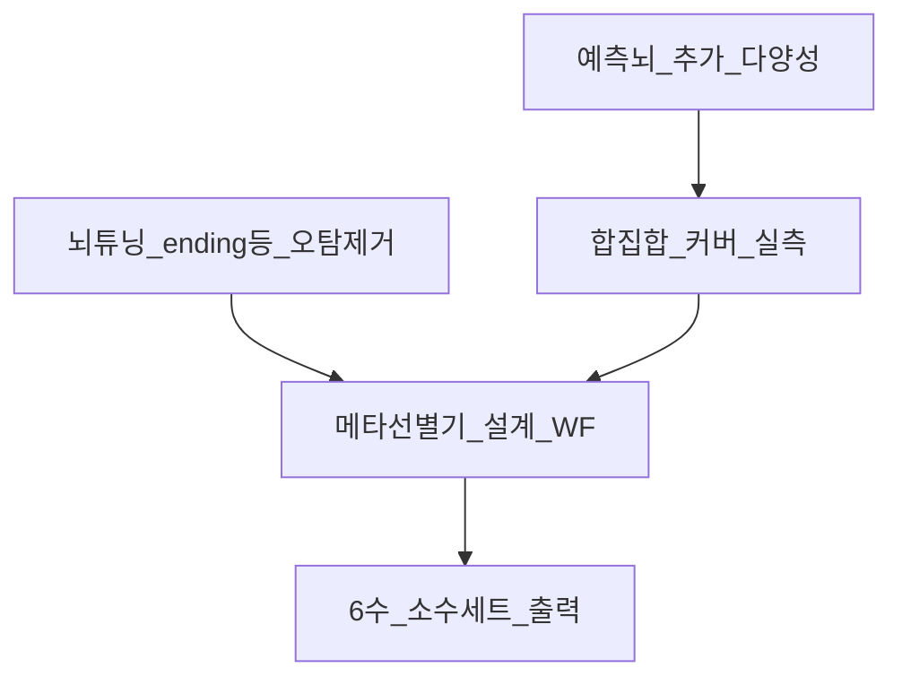

# 병행 로드맵 (커서 권한 · 형 계획)

> **PIN Primary = Track B** (형계획 메타선별). 변경 시 형 승인.  
> 상세: [PINNED_PLAN.md](PINNED_PLAN.md) · [external_methods_pin.md](external_methods_pin.md)

## PIN — Track B Primary (형 계획 메타선별)
1. ✅ 합집합 커버 실측 (`union_coverage*.json`) — cover6 ~27.9%
2. ✅ Vote≥2 단독 WF — avg 0.79 vs best 2.22 → **기각**
3. P1: 보조4뇌 시드 + Vote 하이브리드 WF
4. P2: cover=6 회차 선별 규칙 마이닝
5. P3: 유사과거 렌즈 5종 swarm
6. P4: 다양성 KPI (뇌 추가 게이트)
7. P5: `meta_assemble_sets` (UI는 1차 통과 후)

## Track A — 튜닝 (병행 · 주인공 아님)
1. ending_digit 자기강화 **수정 완료** (af4a522)
2. odd_even 등 유사 오탐 점검 (P1과 충돌 없을 때만)
3. brain_review 전구간 재WF — 메타 1차 통과 후

## Track C — 뇌 확장 (다양성 KPI 후)
- 새 뇌 = 새 렌즈 (Jaccard/unique/cover6 게이트 통과 시만)
- `predict_sets` 유지 + `meta_assemble_sets(pool) -> K sets`

## 성공 정의 (메타 1차)
- WF에서 메타 avg_match ≥ 운영 시드 **그리고** 오라클 best에 Δ 개선
- cover&lt;6 = 「풀 부족」 분리 리포트
