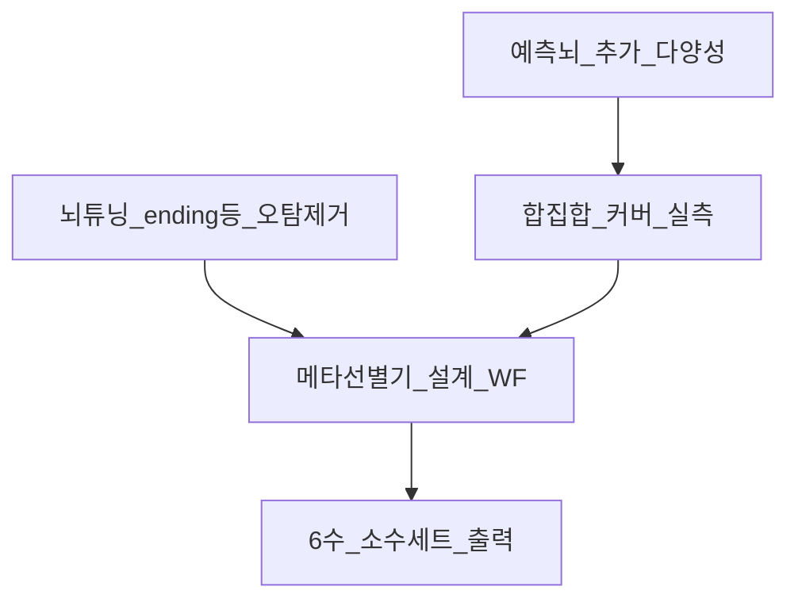

# 병행 로드맵 (커서 권한 · 형 계획)

## Track A — 튜닝 (진행 중·계속)
1. ending_digit 자기강화 **수정 완료** (af4a522)
2. odd_even 등 유사 오탐 점검
3. (선택) brain_review missed_patterns 전구간 재WF

## Track B — 형 계획 메타선별 (병행 **지금 시작**)
1. ✅ 과거 합집합 커버 실측 (`union_coverage*.json`)
2. 다음: Vote≥2 + 보조채점 프로토타입 (읽기·도구 먼저, UI는 이후)
3. cover=6 회차에서 당첨 6수 선별 규칙 탐색
4. walk-forward로 메타 출력 avg_match vs 단일 best 세트 비교

## Track C — 뇌 확장 (튜닝·메타 기반 후)
- 새 뇌 = 새 렌즈 (다양성 KPI 충족 시만)
- 출력 구조: `predict_sets` 유지 + `meta_assemble_sets(pool) -> K sets`

## 성공 정의 (메타 1차)
- 과거 WF에서 메타 6수의 avg_match가 **동일 회차 best 단일세트**를 유의하게 상회
- cover&lt;6 회차에서는 「선별 실패」가 아니라 「풀 부족」으로 분리 리포트
